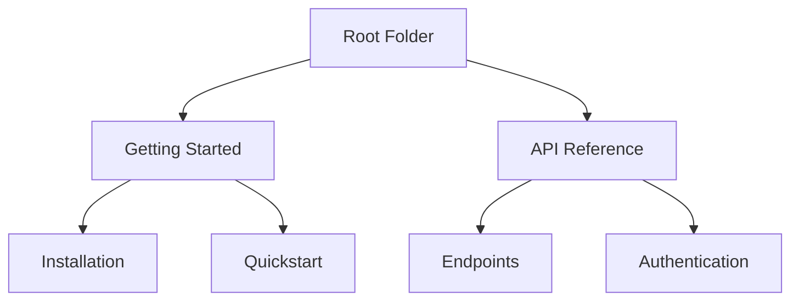

## Overview

The Kibabii Academy Documentation platform empowers you to create, manage, and share comprehensive documentation projects. Organize your content hierarchically, edit with powerful tools, collaborate seamlessly with teams, and navigate efficiently with advanced search. These core features streamline your workflow from initial setup to public deployment.

<Columns cols={2}>
  <Card title="Document Organization" icon="folder" href="#">
    Structure your docs into folders, pages, and sections for intuitive navigation.
  </Card>
  <Card title="Editing Tools" icon="edit-3" href="#">
    Rich MDX editor with live preview and syntax highlighting.
  </Card>
  <Card title="Collaboration" icon="users" href="#">
    Real-time editing, comments, and version history for teams.
  </Card>
  <Card title="Search & Navigation" icon="search" href="#">
    Full-text search, breadcrumbs, and sidebar menus.
  </Card>
</Columns>

## Document Organization

Build a clear hierarchy for your documentation. Create nested folders and pages to mirror your project's structure. Use frontmatter for metadata like titles and descriptions.

<Callout kind="tip">
  Start with a root `docs/` folder and add `index.mdx` for landing pages.
</Callout>



Customize sidebar navigation by editing `sidebar.json` or using auto-generation based on folder structure.

## Editing and Formatting Tools

Edit documents directly in the browser with MDX support. Leverage components like `<Callout>`, `<Steps>`, and code blocks for rich content.

<Tabs>
  <Tab title="Markdown" icon="file-text">
    Write standard markdown for headings, lists, and tables.
  </Tab>
  <Tab title="MDX Components" icon="code">
    Embed interactive elements like tabs and cards.
  </Tab>
  <Tab title="Live Preview" icon="eye">
    See changes instantly without rebuilding.
  </Tab>
</Tabs>

<CodeGroup tabs="MDX,Markdown">
  ```mdx
  ## Heading

  <Callout kind="info">
    This is interactive content.
  </Callout>
  ```
  ```markdown
  ## Heading

  > This is a blockquote.
  ```
</CodeGroup>

## Collaboration Workflows

Invite team members to edit simultaneously. Track changes with version history and resolve conflicts easily.

<Steps>
  <Step title="Invite Collaborators" icon="user-plus">
    Share your project link and set permissions: view, edit, or admin.
  </Step>
  <Step title="Real-Time Edits" icon="edit-3">
    Multiple users edit the same page with live cursors and presence indicators.
  </Step>
  <Step title="Review Changes" icon="git-branch">
    Use diff views to approve or revert modifications.
  </Step>
  <Step title="Publish" icon="globe">
    Deploy updates to a custom domain after approval.
  </Step>
</Steps>

<Expandable title="Advanced Permissions" default-open="false">
  Assign roles like Editor (content only) or Maintainer (structure and deploys).
</Expandable>

## Search and Navigation

Find content quickly with full-text search across all pages. Use breadcrumbs, table of contents, and customizable sidebars for effortless browsing.

| Feature | Description | Example |
|---------|-------------|---------|
| Full-Text Search | Indexes titles, headings, and body text | Query: `authentication flow` |
| Breadcrumbs | Shows current path | Home > API > Endpoints |
| Auto-TOC | Generates table of contents from headings | Links to H2/H3 sections |
| Keyboard Shortcuts | `Ctrl+K` for search, `?` for help | Speeds up navigation |

Integrate custom search with Algolia or use the built-in engine for instant results.