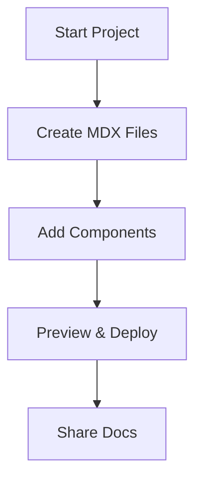

## Platform Overview

Welcome to the Kibabii Academy Documentation platform. You use this space to organize, manage, and publish all your project documentation in one centralized location. It supports MDX for rich, interactive pages with components like tabs, steps, and code examples. Teams collaborate seamlessly with version control, search, and customizable themes using the brand color `#3B82F6`.

<Callout kind="info">
  This platform powers structured docs for Kibabii Academy projects, making knowledge accessible and up-to-date.
</Callout>

## Key Benefits

Discover how Kibabii Academy Documentation streamlines your workflow.

<Columns cols={3}>
  <Card title="Centralized Hub" icon="database" href="/docs/organization">
    Store all docs in one place with folders, tags, and full-text search.
  </Card>
  <Card title="Interactive Content" icon="code" href="/docs/mdx-components">
    Embed live code, diagrams, and components directly in MDX pages.
  </Card>
  <Card title="Team Collaboration" icon="users" href="/docs/collaboration">
    Edit, review, and publish with Git-based workflows and previews.
  </Card>
</Columns>

## Getting Oriented

Follow these steps to start using the platform effectively.

<Steps>
  <Step title="Create Your Space" icon="plus">
    Sign up and initialize your documentation repository. Use the dashboard to set up your first project folder.

    <CodeGroup tabs="CLI,Web">
      ```bash
      npx create-kibabii-docs my-project
      cd my-project
      npm run dev
      ```
      ```typescript
      // In your app.tsx
      import { KibabiiProvider } from '@kibabii/docs';
      <KibabiiProvider apiKey="your-key">
        <DocumentationSpace />
      </KibabiiProvider>
      ```
    </CodeGroup>
  </Step>
  <Step title="Add Content" icon="file-text">
    Write MDX files in the `docs/` directory. Preview changes locally before publishing.
  </Step>
  <Step title="Customize Theme" icon="palette">
    Update `theme.config.tsx` with your brand color `#3B82F6` and deploy.
  </Step>
</Steps>

## Explore by Role

Tailor your experience based on your needs.

<Tabs>
  <Tab title="Developers" icon="code">
    Integrate API docs with `<Request>` and `<Response>` components. Query your endpoints directly in docs.

    ```javascript
    const docsClient = new KibabiiDocsClient({ apiKey: process.env.KIBABII_API_KEY });
    const pages = await docsClient.pages.list({ project: 'my-project' });
    ```
  </Tab>
  <Tab title="Designers" icon="monitor">
    Use custom components and brand guidelines. Embed Figma previews and style with `#3B82F6`.
  </Tab>
  <Tab title="Managers" icon="users">
    Track updates with changelog components and analytics on doc views.
  </Tab>
</Tabs>

## Brand Guidelines

Adhere to Kibabii Academy standards for consistency.

<ExpandableGroup>
  <Expandable title="Primary Color" default-open="true">
    Use `#3B82F6` for links, buttons, and accents. Pair with neutral grays for text.
  </Expandable>
  <Expandable title="Typography">
    Headings: Inter Bold, Body: Inter Regular. Limit H1 to page titles only.
  </Expandable>
  <Expandable title="Icons">
    Source from Lucide library. Examples: `book-open`, `code`, `users`.
  </Expandable>
</ExpandableGroup>



You now have a solid foundation. Dive into specific guides to build powerful documentation.